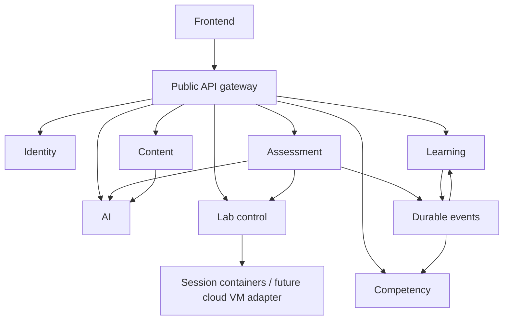

# Service architecture

Status: accepted target for `rebuild/service-architecture`. Implementation and verification status are recorded in [migration status](../migration/status.md). A directory or endpoint existing is not proof of behavioral parity.

## Deployment boundaries

Identity, learning, assessment, competency, content and labs own durable records. AI and the gateway do not own a domain database. PostgreSQL is shared infrastructure, not a shared application model: each stateful service has its own schema, credentials and migration history.

The frontend is an independently built application under `apps/frontend`. In this migration its existing screens, routes and feature internals are preserved. A fresh frontend is a separate, explicitly deferred project.

## Repository rules

- `apps/` contains applications serving the user: frontend and gateway.
- `services/` contains independent domain deployments. A service may have API and worker processes built from the same image.
- Service `api/` modules validate requests and serialize results. `application/` orchestrates use cases; `domain/` implements rules; `adapters/` owns database, messaging, storage and remote clients.
- Services must not import each other's implementation or import `backend/app`. Calls cross versioned interfaces.
- Services must not read or mutate another service's schema, including through shared ORM classes, views or foreign keys. External identifiers are references, not cross-schema constraints.
- Shared libraries contain infrastructure behavior that must be identical, never business records, repository classes or a shared ORM base. A shared library is introduced only when needed.
- `contracts/` contains exported HTTP contracts and versioned event schemas. Service request/response types own HTTP definitions; generated files must not become competing hand-maintained definitions.
- Reviewed small content assets may be tracked in `content/`. Uploads, recordings, generated artifacts and runtime logs live outside Git.
- Keep tests, dependency manifests and migrations with the service that owns them. Root tests verify contracts and complete journeys.
- Use explicit migrations and seed commands. Importing an application must not connect to a database, create tables, seed data or call a provider.

## Interfaces and failures

Internal APIs use `/v1`. The gateway preserves the copied frontend's `/api` routes through an explicit mapping. It must not silently route unknown endpoints to the old monolith. Compatibility adapters translate transport shapes; grading and completion rules stay in the owning service.

Each service validates authentication and permissions; a proxy does not replace authorization. Transitional JWT verification preserves existing account identifiers. Only identity verifies password hashes and issues user tokens. Service credentials are distinct from user credentials. Headers supplied by browsers are not trusted identity claims.

Expensive generation, document processing and provisioning belong in owned jobs. The target transport is RabbitMQ with service-local Celery workers. A job has durable ownership, state, timestamps and a result/error reference. Broker loss must not produce a successful-looking response or discard accepted work.

Business events use a transactional outbox at the producer and deduplication at consumers. The minimum envelope contains event ID, event type/version, source, subject ID, occurrence timestamp, correlation ID and payload. Consumers tolerate retries; no exactly-once delivery assumption is allowed. Failures remain observable and replayable.

Provider failure must be explicit. Deterministic fallback is allowed where meaningful, but estimated scores and generated drafts must identify their provenance. Missing dependencies return an unavailable or pending state instead of fabricated success.

## Data ownership

See [service catalogue](../services/README.md) and [migration mapping](../migration/data-ownership.md). Identity owns accounts; learning owns course completion/certification; assessment owns attempts and authoritative grades; competency owns evidence interpretation. AI cannot award credentials, and execution runtimes cannot mutate learner records.

Migration preserves historical records, identifiers and password hashes. Rebuilding algorithms does not retroactively rewrite scores. Existing assessment policies are carried forward unless changed through a recorded product decision.

## Execution boundary

Lab control is an application service. Learner execution is a different trust boundary on an execution host. Local containers are the first adapter, not an assertion of VM-equivalent isolation. Cloud VM labs follow the completed application rebuild. See [lab operations](../operations/labs.md).
